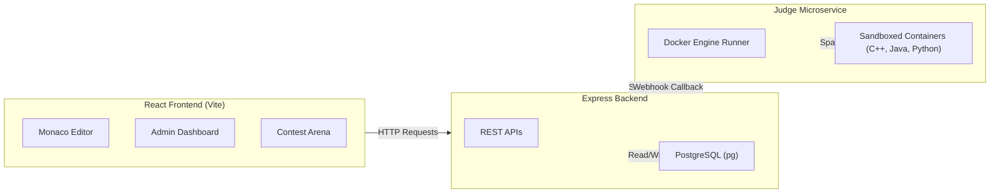

# CodeArena — Online Judge Platform ⚡

CodeArena is a modern, high-performance Online Judge platform tailored for competitive programming. It features a sleek dark-themed UI, a real-time Monaco-based code editor, and a highly isolated, Docker-based code execution microservice capable of running untrusted C++, Java, and Python submissions.

---

## 🏗️ Architecture

CodeArena embraces a microservices-inspired architecture designed for scalability and security.



### Core Components
1. **Frontend**: A React SPA built with Vite. It features a premium dark mode, Monaco Editor integration, and role-based access control (Admin vs User).
2. **Main Backend**: A Node.js/Express server that acts as the single source of truth. It handles authentication (JWT), user management, problem CRUD, and contest administration.
3. **Database**: PostgreSQL handles all relational data, including Users, Problems, Test Cases, Contests, and Submissions.
4. **Judge Worker**: A dedicated Node.js microservice that receives code from the main backend, spins up ephemeral, highly restricted Docker containers (no network, limited RAM/CPU) to compile and execute the code against hidden test cases, and returns the verdict (`AC`, `WA`, `TLE`, etc.) via a webhook callback.

---

## 🚀 Setup Steps

### Prerequisites
- [Docker & Docker Compose](https://www.docker.com/) installed and running.
- (Optional) Node.js v24+ for local development without Docker.

### 1. Start the Environment
Run the entire stack using Docker Compose:
```bash
docker-compose up --build -d
```
*Note: The first run might take a few minutes as it downloads the PostgreSQL, Node, Nginx, GCC, OpenJDK, and Python images.*

### 2. Run Database Migrations
Once the containers are up, execute the migration script inside the backend container to create the tables:
```bash
docker exec -it oj-backend npm run migrate
```

### 3. Bootstrap an Administrator
To manage problems and test cases, you need an admin account. 
1. Open the frontend at `http://localhost:5173`.
2. Sign up for a new account.
3. Elevate your account to admin by running:
```bash
docker exec -it oj-backend node scripts/make_admin.js "your_username"
```

### 4. Access the Application
- **Frontend App**: `http://localhost:5173`
- **Backend API**: `http://localhost:5000`
- **Judge Worker**: `http://localhost:5001`

---

## 📖 API Documentation

The backend API is RESTful and communicates using JSON. Protected routes require a Bearer token in the `Authorization` header.

### Authentication
- `POST /api/auth/register` - Register a new user.
- `POST /api/auth/login` - Login and receive JWT tokens.
- `POST /api/auth/refresh` - Refresh access token.

### Users
- `GET /api/users/me` - Get the authenticated user's profile.
- `PUT /api/users/me` - Update profile information.
- `GET /api/users/:username` - View a public profile.
- `GET /api/leaderboard` - Get global rankings based on rating and solved problems.

### Problems
- `GET /api/problems` - List all published problems.
- `GET /api/problems/:slug` - Get a specific problem's details.
- `POST /api/problems` - (Admin) Create a new problem.
- `PUT /api/problems/:id` - (Admin) Update a problem.
- `DELETE /api/problems/:id` - (Admin) Delete a problem.

### Test Cases
- `GET /api/testcases/problem/:id` - (Admin) Get all test cases for a problem.
- `POST /api/testcases` - (Admin) Add a test case.
- `DELETE /api/testcases/:id` - (Admin) Delete a test case.

### Submissions
- `POST /api/submissions` - Submit code for evaluation.
- `GET /api/submissions` - List submissions (filterable by user and problem).
- `GET /api/submissions/:id` - Get submission details and verdict.
- `POST /api/submissions/internal/callback` - (Internal) Used by the Judge Worker to report verdicts.

### Contests
- `GET /api/contests` - List contests (upcoming, active, ended).
- `GET /api/contests/:slug` - Get contest details and problem list.
- `POST /api/contests/:slug/register` - Register for a contest.
- `GET /api/contests/:slug/leaderboard` - Live contest scoreboard.

---

## 📸 Screenshots

*(Replace the placeholder links below with actual screenshots of your application)*

### Problem Solving Interface

*The Monaco-powered code editor with language selection, dark theme, and immediate verdict feedback.*

### Admin Dashboard

*Manage problems, test cases, and publishing statuses from a secure control panel.*

### Contest Scoreboard

*Live ICPC-style contest rankings with dynamic penalty calculations.*
